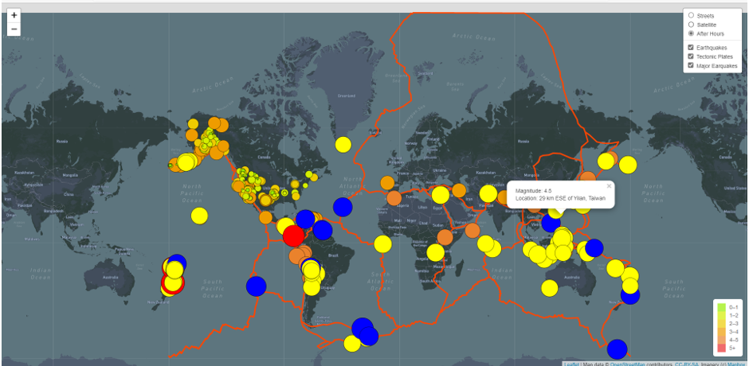
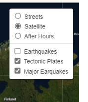
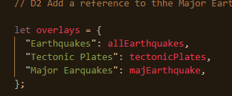
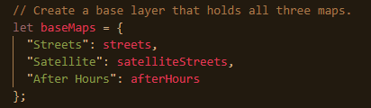
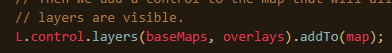
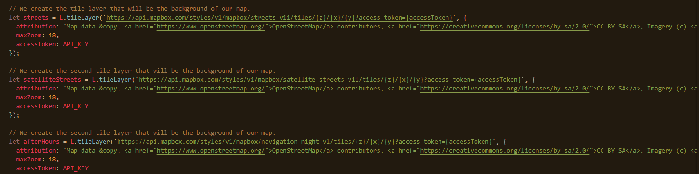
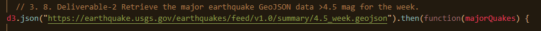
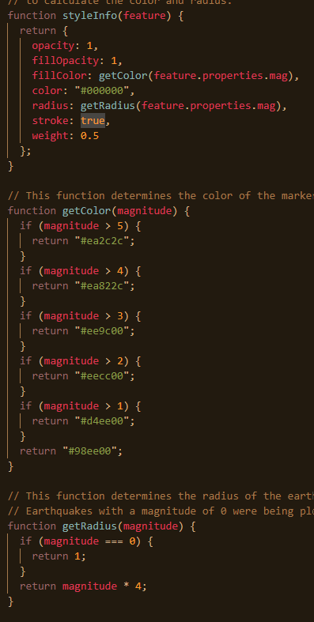
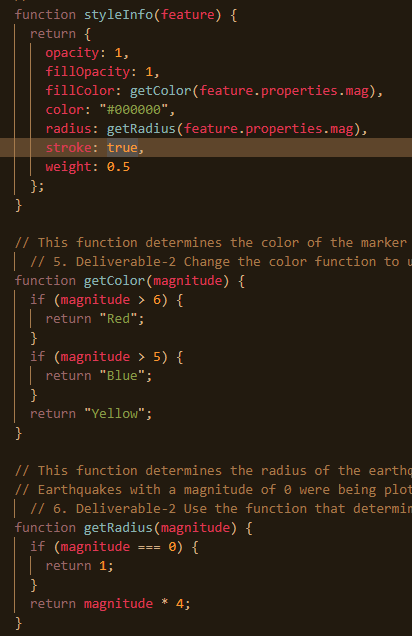
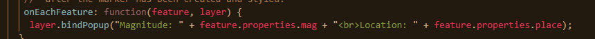

# Mapping_Earthquakes
Mod13

## Overview of Project:

The overview of this project is to create a visually stimulating webpage that will allow the user to interact with the webpage.  They will be able to select from multiple map styles and overlay information regarding tectonic plates and earthquakes with varying magnitudes. We will achieve this by using JavaScript, CSS and HTML to refrence to JSON files from multiple websites.

### Purpose:
The purpose of this project is to create a webpage with direction from Basil and Sadhana to create an earthquake map with three different maps and multiple overlays to highlight the relationship of earthquakes in reference to the Earth's tectonic plates.  The end product will allow the user to select which map style they prefer from the three options provided. The user will then be able to select what data will be visible from a set of options provided.  The user will be able to turn on or off visual data pertaining to earthquakes in the last seven days, earthquakes with a magnitude of 4.5 or greater, and tectonic plates.  The user will have the ability to turn on one, some, all, or none of those options.

* Screenshot of webpage with layer, map options, and Popup selected:

The following screenshots will highlight the code aspect of the project to highlight certain features from the webpage shown above:

* Most of the webpage functionality, from the user's standpoint can be controlled using this map layer control feature.

* The following two snippets of code provide the naming of the maps and overlays that will be displayed in the control box feature above:

* This code snippet below will place the control for the base maps and overlays in the control box.

* Now the code below, allows us to access created maps to pull into our webpage for use in our display.  The API links below is what is displayed when the user changes map selection.

* The snippet below shows the use of d3 GeoJSON to access a JSON file and pull it into the webpage for use.  The snippet below shows code used to access the JSON file for earthquakes with a magnitude of 4.5 or greater.  There were two other d3 GeoJSON's created to access the data for tectonic plates and all earthquakes in the past seven days.

* Below you will find the use of a function that controls the styling of the GeoJSON data added for earthquakes in the past seven days. It controls the size, shape, and colors of the circles added for each earthquake.

* Now, let's repeat this but, using a function that controls the styling of the GeoJSON data added for earthquakes in the past with a magnitude of 4.5 or greater. It controls the size, shape, and colors of the circles added for each earthquake.

* This snippet below adds a popup functionality of magnitude information and location to each point that was plotted and styled from the functions above:

## Results:

The result is a visually appealing webpage with nice functionality.  It is user friendly and inviting and has the look and feel of well thought out and designed webpage.  It allows the user to interact with the webpage to modify the type of map and the information that overlays these maps.  It delivers upon all of Basil and Sadhana's request and requirements.

## Summary:
This was an interesting project, and I learned a lot.  I see many opportunities to use what I learned from this project with my current position at my company in my current role.

Something that I saw would be an interesting add-on to this project would be the addition of a GeoJSON layer for volcanoes.  Agreed, that volcanoes do not fall in the focus of this project, which has its focus on earthquakes but, it would be interesting to see this correlation.  Perhaps it is something that I could circle back after bootcamp and try out myself.
